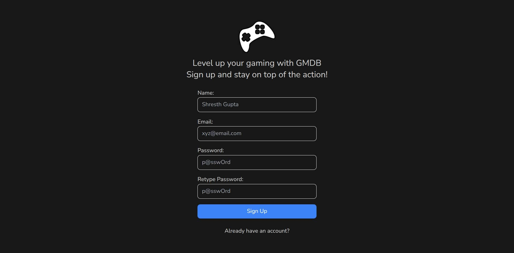
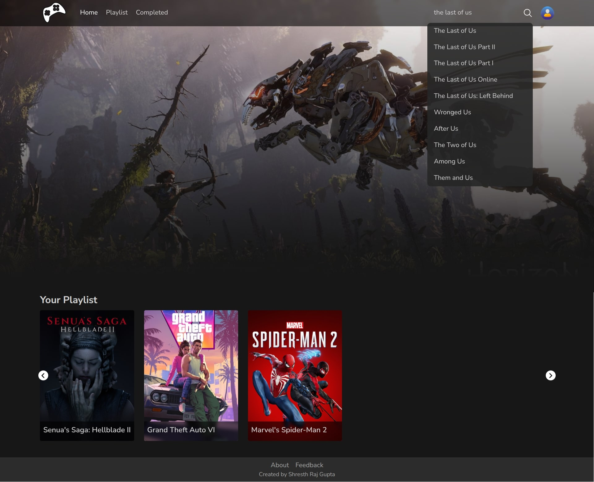
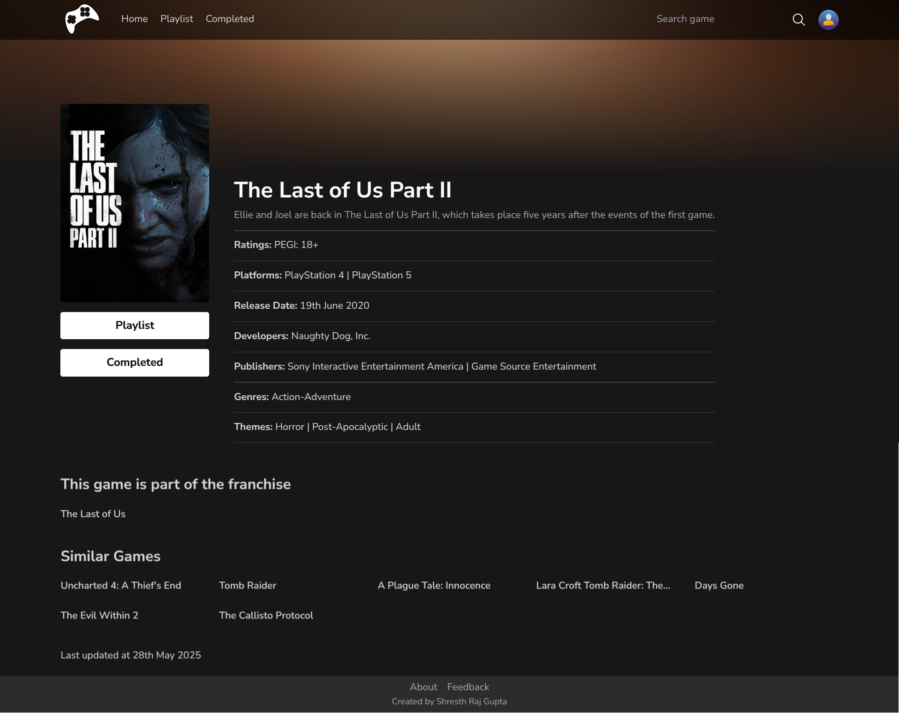
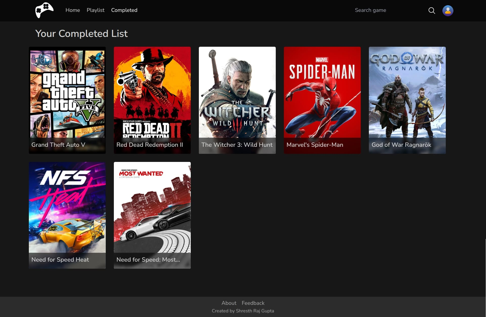
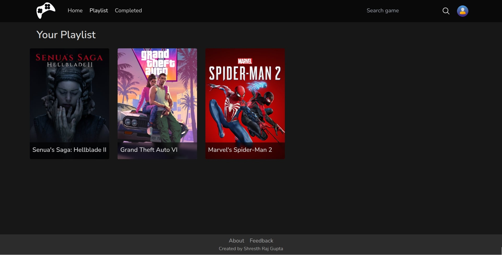

# GMDB – Game Management Database

GMDB is a comprehensive web application designed to help gamers track their gaming journey. Inspired by IMDb's movie tracking system, GMDB brings a similar experience tailored specifically for video games. Whether you're currently playing, have completed, or planning to play a game, GMDB allows you to manage and monitor your entire gaming collection in one place.

### Screenshots











***

### Features
- **User Authentication**: Secure login and signup functionality with JWT-based authentication
- **Game Tracking**: Add games to your personal collection and update their status
- **Search Functionality**: Powerful search feature to discover and add games to your collection
- **Rating System**: Rate games on a scale and share your personal gaming experiences
- **Responsive Design**: Fully optimized for desktop, tablet, and mobile devices

***

### Technologies Used
- **Frontend**: React.js, Redux Toolkit
- **Backend**: Node.js, Express.js
- **Database**: MongoDB
- **Authentication**: JSON Web Tokens (JWT)
- **Version Control**: Git & GitHub

***

### Installation & Setup
1) Clone the repository:
```bash
git clone https://github.com/shresthrajgupta/gmdbv2.git
cd gmdbv2
```

2) Setup the backend:
```bash
npm install
```

3) Setup the frontend:
```bash
cd ../client
npm install
```

4) Run Application:
```bash
cd ..
npm run dev
```

5) Access the application:
Open your browser and navigate to `http://localhost:5173`

***

### Contributing
I welcome contributions from the community!

***

### License
This project is licensed under the ISC License